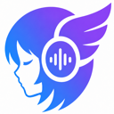

<div align="center">



# Gemini Live Caption

**为浏览器里的_任意_音频提供实时翻译字幕 —— 由 Google Gemini 驱动。**

[](manifest.json)
[](https://www.google.com/chrome/)
[](https://ai.google.dev/gemini-api/docs/live)
[](LICENSE)
[](#参与贡献)
[](https://github.com/SodiumHydride/gemini-live-caption)

[English](README.md) | 中文

[安装](#快速开始) · [功能](#功能特点) · [工作原理](#工作原理) · [技术亮点](#技术亮点) · [路线图](#路线图) · [参与贡献](#参与贡献)

<br/>

<!-- TODO: 用真实的 demo.gif 替换这张占位图（录制一段 YouTube 视频被实时字幕翻译 + 画中画窗口），放到 docs/demo.gif 并更新下方 src。 -->


</div>

---

## 为什么需要它

Chrome 自带的实时字幕只能**转录英文**，不做翻译；大多数直播、播客、网课、会议**根本没有字幕轨**；而网页翻译插件又不处理音频。

**Gemini Live Caption** 捕获任意标签页的音频，将其转为实时**翻译**字幕 —— 以可拖拽的浮层显示在页面上，或放进一个切换标签页也始终置顶的**画中画**窗口。只需自带一个 [Gemini API Key](https://aistudio.google.com/apikey)，网络上任何音频都能变成你看得懂的语言。

> 适用场景：外语网课与讲座、没有翻译的 YouTube/Twitch 直播、播客、远程会议。

## 横向对比

| | **Gemini Live Caption** | Chrome 实时字幕 | 字幕 / 网页翻译插件 |
|---|:---:|:---:|:---:|
| 70+ 语言互译 | ✅ | ❌（仅转录） | ⚠️ 只翻文本，不翻音频 |
| 翻译管线 | **端到端 · Gemini 3.5** | 仅转录 | 转录 → 翻译（两段式） |
| 任意标签页音频可用（不依赖平台字幕轨） | ✅ | ✅ | ❌ 依赖平台字幕 |
| 双语（原文 + 译文） | ✅ | ❌ | ❌ |
| 浮动画中画窗口 | ✅ | ❌ | ❌ |
| 历史记录 + SRT 导出 | ✅ | ❌ | ⚠️ 少见 |
| 拖拽 / 缩放 / 位置预设 | ✅ | ❌ | ⚠️ 有限 |
| 无后端，音频直连 Google | ✅ | ✅ | 视情况 |

**为什么端到端更重要：** 大多数插件把语音识别引擎（Deepgram、Whisper）和一个*独立*的翻译模型串起来——转录错误会层层传导，延迟也会叠加。Gemini Live Caption 直接用 Google 的 `gemini-3.5-live-translate` **端到端**模型：一个模型边听边译，自动识别源语言，70+ 语言下延迟更低。

## 功能特点

**翻译**
- 🌐 **70+ 语言**实时语音翻译（自动识别源语言）
- 🌍 **双语模式** —— 原文与译文同时显示

**显示**
- 🪟 浮动字幕浮层 —— 可拖拽、缩放，自定义字体大小、颜色与透明度
- 📺 **画中画**窗口 —— 切换标签页也始终可见
- 📍 **6 个位置预设**（上/下 × 左/中/右）

**效率**
- 📜 **字幕历史面板** —— 双击展开，可滚动，带时间戳
- 💾 **SRT 导出** —— 将字幕历史下载为字幕文件

**可靠性** _（最难的部分 —— 见[技术亮点](#技术亮点)）_
- 🔄 围绕 Gemini ~10 分钟连接上限的自动会话轮换
- 🔌 指数退避重连 + 字幕看门狗（应对静默卡死）
- 🎧 音频设备热插拔恢复（耳机 / 蓝牙插拔）
- ♻️ 可在 service worker 重启后存活的崩溃安全状态机

**隐私**
- 🔒 无中间服务器 —— 音频从浏览器直连 Google
- 🔑 API Key 仅存本地，除发往 Google 外不会离开设备
- 🚫 零分析、零追踪、零遥测

## 快速开始

### 1. 安装

**从源码安装（开发者模式）：**
1. 下载或克隆本仓库
2. 打开 Chrome，访问 `chrome://extensions`
3. 开启右上角 **开发者模式**
4. 点击 **加载已解压的扩展程序**，选择项目文件夹
5. 扩展图标出现在工具栏中

### 2. 获取 Gemini API Key（有免费额度）

1. 前往 [aistudio.google.com/apikey](https://aistudio.google.com/apikey)
2. 登录并点击 **Create API key**
3. 复制密钥（以 `AIza…` 开头）

### 3. 开始字幕

1. 打开任意有音频的页面（如 YouTube 视频）
2. 点击扩展图标，粘贴 Key，选择目标语言
3. 点击 **Start**（或按 `Alt+C`）
4. 字幕以浮层出现 —— 点击 PiP 按钮可弹出独立窗口

## 工作原理

```
标签页音频
  → chrome.tabCapture
  → AudioWorklet（多相分解 + Kaiser 窗 FIR 降采样至 16 kHz）
  → WebSocket → Gemini Live Translate API
  → 解析转录流
  → Shadow DOM 字幕浮层
  →（可选）转发到画中画窗口
```

扩展捕获标签页音频，经 WebSocket 流式传输到 Gemini Live Translate API，并将翻译结果渲染到屏幕上。它全自动管理连接生命周期 —— 在会话过期前轮换、断线时重连 —— 让字幕保持连续。

## 技术亮点

这是一个刻意打磨过的 MV3 扩展。如果你在学习如何构建生产级 Chrome 扩展，或如何驱动 Gemini Live API，这几处值得一读：

- **专业级 DSP 重采样**（`audio-processor.js`）：Kaiser 窗 FIR 低通，整数比走**多相分解（polyphase）**、非整数比走线性插值 —— 任意输入采样率都能得到干净的 16 kHz 音频。
- **无缝长会话**（`offscreen.js`）：主动会话轮换、`sessionResumption` 续接句柄、应对服务端静默卡死的字幕看门狗、指数退避重连 —— 全部用于抹平 Gemini Live ~10 分钟会话上限。
- **崩溃安全的 MV3 编排**（`service-worker.js`）：带心跳 + ping 恢复的状态机，让捕获在易失的 service worker 重启后仍能存活。
- **健壮的页面内 UI**（`content.js`）：`closed` Shadow DOM 完全样式隔离、XSS 安全渲染、`AbortController` 管理监听器，以及在宿主页删除浮层时自我修复的 `MutationObserver`。

## 路线图

- [ ] 🎙️ 麦克风输入（线下会议与口译）
- [ ] 🌐 完整 UI 国际化（中 / 英 / 日 / …）
- [ ] 🧭 首次使用引导（手把手配置 API Key）
- [ ] 🔌 可插拔的转录后端（降低单一供应商依赖）
- [ ] 🧩 Microsoft Edge 与 Firefox 版本
- [ ] 🎨 可自定义字幕主题

有想法？欢迎[提交 issue](https://github.com/SodiumHydride/gemini-live-caption/issues)。

## 参与贡献

欢迎任何形式的贡献 —— bug 反馈、功能建议、PR 都有帮助。

1. Fork 仓库并创建特性分支
2. 进行修改（纯 JS 代码库，无需构建步骤）
3. 加载已解压的扩展并测试
4. 提交 PR，说明改了什么、为什么

如果这个项目帮你省了时间，给 [GitHub](https://github.com/SodiumHydride/gemini-live-caption) 点个 ⭐ 能实实在在帮它触达更多人。

## Star 趋势

<a href="https://star-history.com/#SodiumHydride/gemini-live-caption&Date">
  
</a>

## 系统要求

- Chrome 116+（需要 Document Picture-in-Picture 与 offscreen document 支持）
- Gemini API Key —— [aistudio.google.com](https://aistudio.google.com) 提供免费额度

## 隐私与免责声明

- 音频从浏览器直连 Google Gemini API，无中间服务器。详见[隐私政策](PRIVACY.md)。
- **免费 Key：** Google 可能将你的音频用于模型训练和人工审核。敏感场景请用付费 Key。见 [Google 条款](https://ai.google.dev/terms)。
- **合规使用：** 未经许可请勿捕获受版权保护的内容，未经同意请勿录制私人对话。使用 Google Gemini API 需年满 18 岁。
- 本扩展按"原样"提供，不附带任何形式的担保。

## 许可证

[CC BY-NC 4.0](LICENSE) —— 仅限非商业用途。

<sub>由 <a href="https://github.com/SodiumHydride">NaH</a> 构建 · 由 Google Gemini 驱动</sub>
